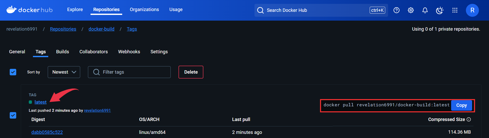

# Build Docker Image and Push it to Docker Hub

Steps taken to complete this project.

Step 1: Create a Repository in Docker Hub
Step 2: Create a GitHub Repository and Clone it on Your Computer
Step 3: Create the Dockerfile
Step 4: Create the Shell Scripts File
Step 5: Create a CodeBuild-Managed Environment Variable
Step 6: Create the Buildspec File
Step 7: Generate a Personal Access Token
Step 8: Create a CodeBuild Project
Step 9: Build Another Docker Image and Push it to Docker Hub
Step 10: Clean Up

## Dockerfile

First we define our Dockerfile to be used in containerizing our application.

```dockerfile
# Use Ubuntu as the base image
FROM ubuntu:latest

# Install dependencies
RUN apt update && \
    apt install -y apache2 && \
    apt install wget && \
    apt install unzip && \
    apt clean

# Set the working directory
WORKDIR /var/www/html

# Download webfiles
RUN wget https://github.com/Gauravias/hotel/archive/refs/heads/main.zip

# Unzip the downloaded file
RUN unzip main.zip

# Copy files into the html directory
RUN cp -r hotel-main/* /var/www/html/

# Remove unwanted files and directories
RUN rm -rf hotel-main main.zip

# Expose port 80
EXPOSE 80

# Set the default application to run when the container starts
ENTRYPOINT ["/usr/sbin/apache2ctl", "-D", "FOREGROUND"]
```

- In our Dockerfile, we specified Ubuntu as our base OS. The `latest` tag ensures the Dockerfile pulls the most recent stable version of the Ubuntu image available on Docker Hub. We afterward installed dependencies needed to package amd deploy our application. 
- In `WORKDIR`, we changed the current working directory inside the container to `/var/www/html`, where Apache serves files by default.
- The next set of `RUN` commands prepare our webfiles to be served from the `/var/www/html` directory.
- `EXPOSE` declares that the container listens on port 80, which is the default HTTP port. This allows traffic to access the Apache server.
- `ENTRYPOINT` tells Docker what the container should do when it starts. `apache2ctl` is a command-line tool used to control(START, STOP, or RESTART) the Apache web server. ``-D FOREGROUND` tells Apache to keep running in the foreground. ``Normally, Apache runs as a "background" service (a daemon), but Docker containers need the main process to stay in the foreground. If it doesn’t, Docker thinks the container has stopped and shuts it down.

## Build Container

```bash
#!/bin/bash

# fail on any error
set -eu

# build the docker image
 docker build -f $IMAGE_TAG/Dockerfile -t $IMAGE_TAG .
```

In  build-image.sh, we simply created a bash script to automate the build process of our image, The `IMAGE_TAG` defines the tag for our image. The `-f` tag in the script specifies the directory where our Dockerfile is located. This is useful when building multiple images in a project, where each image has its own Dockerfile in separate directories.

## Push Image to Docker Hub

```bash
#!/bin/bash

# fail on any error
set -eu

# login to your docker hub account
docker login --username $DOCKER_HUB_USERNAME --password  $DOCKER_HUB_PASSWORD

# use the docker tag command to give the image a new name
docker tag $IMAGE_TAG $DOCKER_HUB_USERNAME/$DOCKER_HUB_REPO_NAME

# push the image to your docker hub repository
docker push  $DOCKER_HUB_USERNAME/$DOCKER_HUB_REPO_NAME
```

The script uploads the built image into our Docker Hub repository.

> Note: In both scripts `set -eu` configues the script to fail immediately if 
>*`-e`: any command fails (non-zero exit code). This ensures no subsequent steps are executed if an error occurs.*
>*`-u`: an undefined variable is used, avoiding potential issues caused by typos or missing variable definitions.*

## CodeBuild

```yaml
version: 0.2

phases:
  install:
    runtime-versions:
      python: 3.x

  pre_build:
    commands:
      - chmod +x build-image.sh push-image.sh
      - ./build-image.sh

  build:
    commands:
      - ./push-image.sh
```

This file defines our build instruction for the project. It ties every other thing together (`build-image` and `push-image`). The `install` phase installs the dependencies or set up the run-time environment for the build. The `pre-build` defines execute permission and eventually executes `build-image.sh`. Finally, the `build` phase executes the `push-image` script which handles uploading the built docker image from the preceeding step to  our Docker Hub repository.


## Deployment

Follow the images below to deploy our buildspec.yml on CodeBuild.


---

---

---

---

---

---

---

---

---

---

---

---



> Note: At the `source` section where you specify your repository, you will be required to connect that repository via a Personal Access Token (PAT), generate one on your GitHub account and paste it into the box required. I already did mine that is why it is showing the green-colored `Successfully connected through PAT using CodeBuild managed token`.

Since we designed our project to build multiple images, let's go ahead to build another application and automatically upload it to Docker Hub. Follow the same process as before to deploy the Dockerfile in the `youtube-clone` directory.


---


## CleanUp

Delete the CodeBuild projects you have deployed in this project to avoid being charged by AWS.


